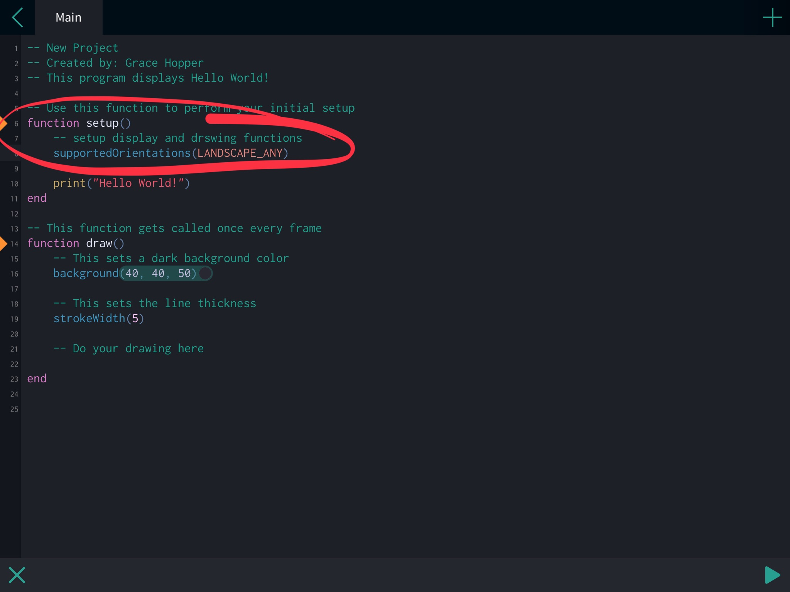
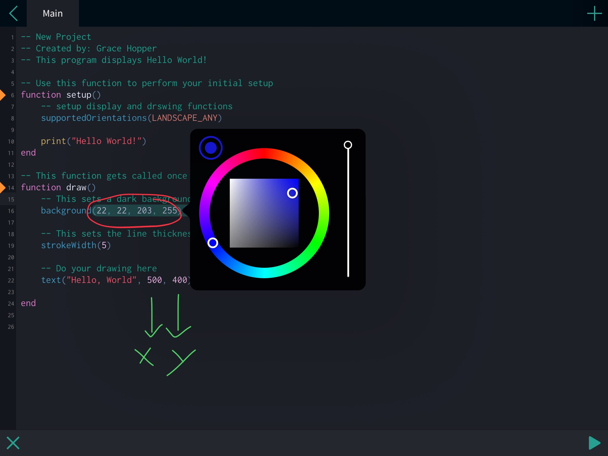
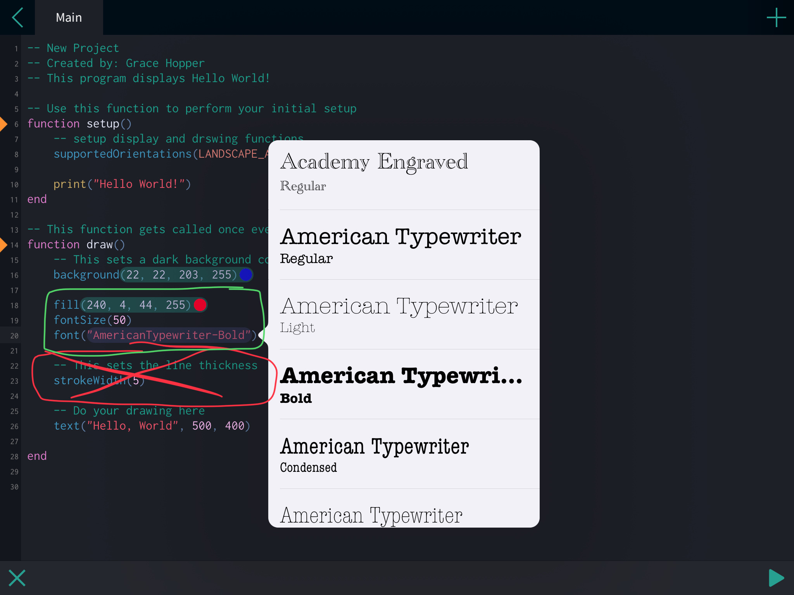

# Coding in CODEA  

## Getting Started: Hello World!  

**Add a New Project**  

Select the Add New Project and name it. Once named, you are brought to the Main screen of the development environment. By default, you have a few lines of code already written in the Lua programming language.  

```lua  
-- New Project

-- Use this function to perform your intial setup
-- This code happens once, and only once  
function setup()
    print("Hello World!")
end

-- This function gets called once every frame (60x/sec)
-- So the game looks fluid
function draw()
    -- This sets a dark background color
    background(40, 40, 50)

    -- This sets the line thickness
    strokeWidth(5)

    --Do your drawing here

end
```  

Lines that start with two hyphons, `--`, are comments.  

`-- This is a Lua comment`  

Comments are for programmers, so the function of the program is better understood. Think of comments like notes to self, or notes to whoever is working on the program. Comments are ignored by Lua.  

Notice in the `setup()` command there is a function called print(), with the text, `'Hello World!'`. The print(), just sends whatever is inside to the Output.  

To run your program, select the run (PLAY button) icon at the bottom right. We can see the result under the **Output** window (console) on the left side. Currently, our code does not do much, just prints 'Hello World!'; there is nothing drawn to the big screen on the right.  

Go ahead and tap the space after **Line 2**. A generic keyboard pops up; however, at the top of the keyboard has an extra line of keys, or shortcuts at the top which can be very helpful when writing code.  

On **Line 2**, create a comment that has your name, hit enter, then make another comment that says what the program does. Here's an example:  

```lua  
-- New Project
-- Created by: Grace Hopper
-- This program displays Hello World!
```  

## Setup Display 

  

## Setup Drawing Functions  

You can easily change a color by selecting inside the parameters.  

  

First number (X coordinate): How far from the bottom-right, moving horizontally, the text is going to start.  

Second number (Y coordinate): How far from the bottom-right, moving upwards, the text will start.  

## "Draw" Text to Screen  

Get rid of the line which has the `strokeWidth()` function.  

Add a few lines that tell the program what color to `fill()` the text with, `fontSize()`, and style of `font()`. Just like with chnaging colors, you can select inside of the `font()` parameters, and choose a font style.  

  

***  


