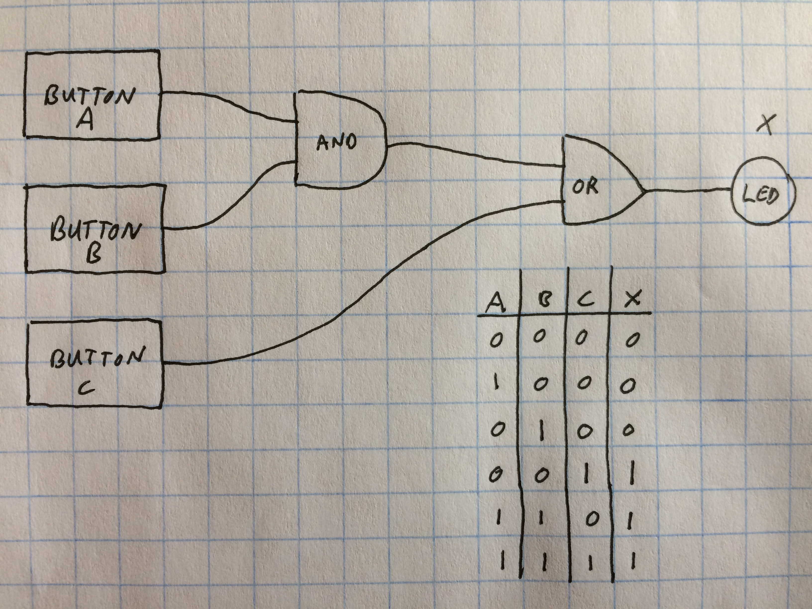
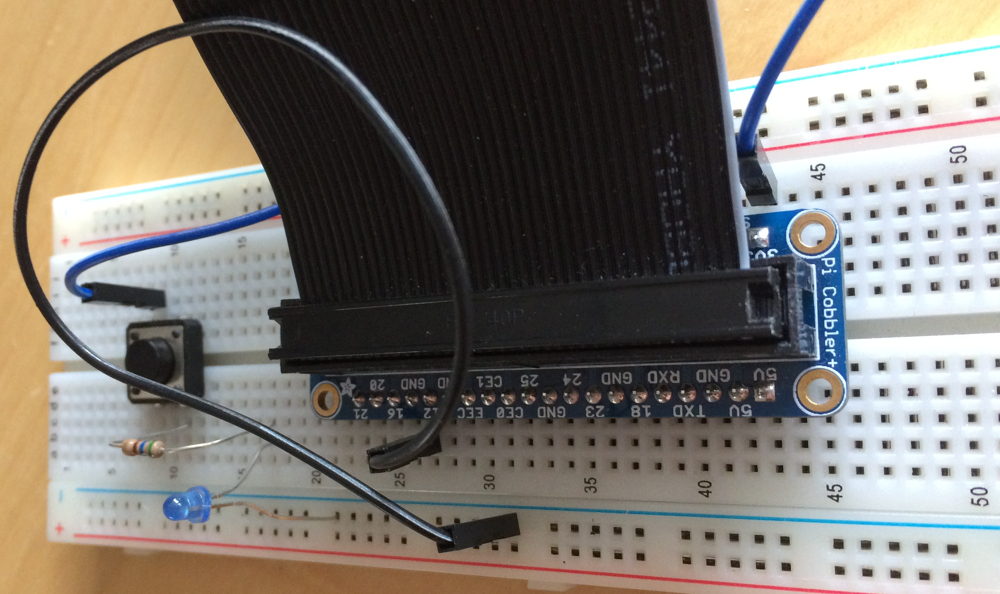
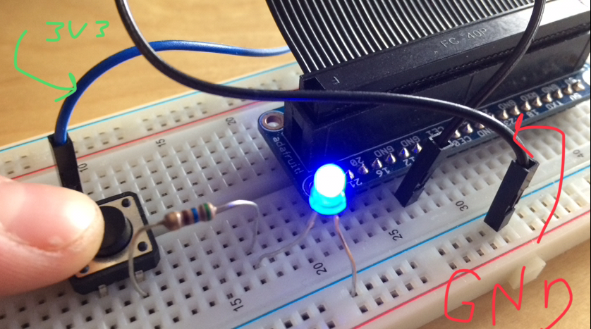

# Circuits  

# Digital Switching Devices  

Logic Design, ipsum oye oye, hear ye, lesson abstract to go here.  

This lesson has proven handy for elementary and middle school ages; specifically, the logic gate activity. *--renditions and addiional lessons to come*  

## Performance Objectives  

Students will be able to - 

* understand the fundamental hardware components off all computers  
* understand how computers handle information  
* understand how computers control the flow of electricity  
* understand Boolean logic  
* understand the basic of logic design  
* represent several logic gates i.e. diagram symbols, truth tables, boolean expressions  
* combine logic gates to make circuits  

# Introduction  
## What are Circuits?  

ipsum lorem  

## Transistors  

## Logic Gates  

### Logic Gates Activity  

Hand out the activity worksheet to each student, [Gates_Rep.pdf](https://github.com/techemstudios/NextUp/tree/master/2018/winter_2018/lucille_brown/intro_cs/mini_lessons/circuits/Worksheets_and_Docs). It is optional to have students draw the logic diagram for each gate, or have them paste them using the diagrams cut and printed from [Printable_Gates.pdf](https://github.com/techemstudios/NextUp/tree/master/2018/winter_2018/lucille_brown/intro_cs/mini_lessons/circuits/Worksheets_and_Docs).  

Sequence of Steps:  

1. Have students label the name of each gate on the paper (e.g. AND, OR, NOT)   
2. Students can work together to list all of the possible scenarios for each gate in the truth table  
3. As a class, go over the Boolean Expression for each gate.  
4. Have students paste or draw each gate inside "Logic Diagram Symbol" box  
5. Ask students to draw a circuit on the back of the paper, using at least two gates, buttons for input, an lED for output; with all the necessary *wire* connections.  

    **Bonus: Represent your circuit with a truth table**  

Example for step 5:  

  

  

  

***   

# Make a Simple LED Circuit  

Using a battery pack or Raspberry Pi and a breadboard, students will leanr how to make the necessary connections to build a circuit, where a switching device (button) controls the flow of electricity to an LED (light emitting diode).  

  

  

  

  

***  

